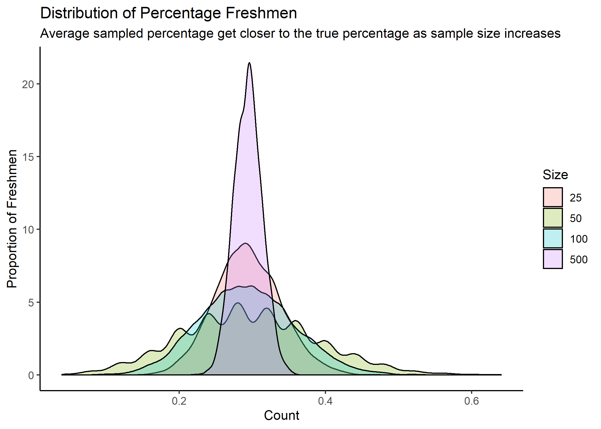

## Objectives

* Students will demonstrate familiarity with the core  concepts of *sampling*
* Students will learn how to use codebooks to find the relevant variables for analysis
* Students will practice data wrangling that requires multiple steps

----
**A note on simulation:** 
We often repeat  simulation exercises a large number of times. If you're having trouble with your computer taking too long on simulations, you can use a smaller number -- just make a note of it in a code comment in your Rmd. 
-----


```{r setup, include=FALSE}
# Setup for the problem set. Note that I'm not loading unnecessary packages;
# i'll need tidyverse and tidycensus for questions 1 and 2, and scales for your
# map. We'll use gt in the simulation exercise.

knitr::opts_chunk$set(echo = FALSE, tigris_use_cache = TRUE)
library(haven)

# map. Magrittr helps us if we want to pipe and assign at the same time, and
# we'll use gt in the simulation exercise.

knitr::opts_chunk$set(echo = FALSE, tigris_use_cache = TRUE)
library(haven)
library(magrittr)
library(ggplot2)
library(infer)
library(reprex)
library(gt)
library(tidyverse)
```

## Mad Libs

For today's Mad libs, we're going to use data from the [Voter Study Group](https://www.voterstudygroup.org/publication/nationscape-data-set-release-1). You'll need to submit a request for the data, and then download the zip file. The data is in .dta format, so you'll want to check out the `haven` package to read it into R. 


Often, when we download big data sets, we need to do a bit of sleuthing to figure out how the data is organized and what the variable names mean. These mad libs are in part designed to have you practice this kind of sleuthing. 

* The folder names in this dataset (and the names of the associated .dta file) are the date that the surveyors began asking questions for each survey "wave". Find the .dta for the survey wave that began December 26, 2019. We recommend moving just that folder to your repo for this pset (rather than putting all the data there). 

```{r read_dta, include = FALSE}
# I use the haven package to read in the dta from 12/26/2019

vsg <- read_dta("raw-data/ns20191226.dta")

```

* Check out the "codebook" pdf, located in the same folder, to give you some hints about the variables you'll need. It also may help you to decode some of the different values assigned for responses to each question.


----


Mad Libs 1-3 have to do with public opinion on guns. 

There are six questions on the survey that have to do directly with guns.

* One question asks whether someone in the household owns a gun.
* There are four policy questions: whether the respondent agrees with **background checks**, whether the government should create a federal **gun registry**, whether the government should **ban guns**, and whether the government should **limit magazines**.
* Finally, there is an **agree/disagree** statement, asking whether it is more important for the government to  control guns or 
* Finally, there is an **agree/disagree** statement, asking whether it is more importnat for the government to  control guns or protect the right to own guns. 

```{r guns_vars}
# Sometimes I like to create a tibble of the variables I'll be working directly
# with. This is not necessary, but can help if you want to explore the data or
# be able to grab it easily


guns <- vsg  %>% 
  select(response_id, household_gun_owner, guns_bg, gun_registry, ban_guns, limit_magazines, statements_gun_rights)

```

```{r ml_1}
# Surveys like this one will often use special codes like 888 or 999 to classify
# non-response or not asked. It's important to be aware of this, expecially if
# the values are numeric. These can really mess up your averages!

ml_1 <- vsg %>% 
  filter(gun_registry != 888) %>% 
  count() %>% 
  pull()
```


**ML 1)** Not all respondents were asked every question.  `r ml_1` respondents were asked the question about whether the USA should create a gun registry.
```{r ml_2}
# Calculating percents using just dplyr is actually surprisingly tedious. In
# this solution, I found it simplle to build a tibble of just the right
# population, and then I could use the length of that tibble to calculate the
# denominator of my "percent" calculation

guns_asked <- vsg %>% 
  filter(gun_registry != 888 &
         ban_guns != 888 &
        guns_bg != 888 & 
        limit_magazines != 888)
  
ml_2 <- guns_asked  %>% 
        group_by(household_gun_owner) %>% 
        count() %>% 
        mutate(percent = n/length(guns_asked$response_id)) %>% 
        filter(household_gun_owner == 1) %>% 
        pull(percent) 
ml_2 <- round(ml_2*100, 2)
      
```
 

**ML 2)** Of the respondents that got asked all four gun policy questions, `r ml_2` percent are gun owners. (For the purposes of this question, you can assume that the people who answered "not sure" are not gun owners). Round to 2 digits after the decimal point. 

```{r ml_3}
# I like using the actual values (household_gun_owner == 3 and
# household_gun_owner == 1| household_gun_owner == 2) rather than the !
# expressions, because then I know exactly which na expressions are or are not
# included in my filter

ml_3a <- vsg %>%  filter(statements_gun_rights != 888 &
                   statements_gun_rights != 999 &
                   statements_gun_rights != ".") %>%
  filter(household_gun_owner == 3) %>% 
  summarize(mean(statements_gun_rights)) %>% 
  slice(1) %>% 
  pull()
ml_3a <- round(ml_3a,2)
  
  
ml_3b <- vsg %>%  filter(statements_gun_rights != 888 &
                   statements_gun_rights != 999 &
                   statements_gun_rights != ".") %>%
  filter(household_gun_owner == 1| household_gun_owner ==2) %>% 
  summarize(mean(statements_gun_rights)) %>% 
  slice(1) %>% 
  pull()
ml_3b <- round(ml_3b,2)

      
```


**ML 3)** The average "agreement" score (from 1-4) on the statement_gun_rights variable is `r ml_3a` for those respondents who live in households without guns, while the average "agreement" score in households with guns is `r ml_3b`. (Calculate the average dropping respondents who weren't asked, didn't know, or skipped either question, and round to two digits after the decimal point).

```{r ml_4}
# Haven imports variable labels from the dta format. We can easily assign those
# labels to a factor class variable, but we need to make sure to make the NA's
# explicit. Then, printing the religion category itself is easy. I have to use
# fct_explicit_na to make sure that the NAs are explicit

vsg <- vsg %>%
  mutate(religion_labelled = fct_explicit_na(as_factor(religion)))

ml_4a <- vsg %>%
  filter(age > 17 & age < 30) %>% 
  count(religion_labelled) %>% 
  top_n(1,n) %>% 
  pull(religion_labelled) 

ml_4b <- vsg %>%
  filter( age > 29) %>% 
  count(religion_labelled) %>% 
  top_n(1,n) %>% 
  pull(religion_labelled) 


```
**ML 4)** Another set of questions asks about religion.  The first ranked category of religion for the age group of people 18-30 (don't include 30) is "`r ml_4a`" . The first-ranked religion category for people 30 and older is "`r ml_4b`".  Hint: you're going to need the "labels" that are imported from the dta using haven; we suggest using as_factor to assign the right labels to the religion variable. 


```{r ml_5}
# Rank is a handy function within the summarize category. Note that I'm using
# desc to suggest that the higher numbers should have the lowest values for rank
# I could also have done a group_by and then just pulled elements of a list for
# the a and b values of this mad lib


ml_5a <- vsg %>%
  filter(age > 17 & age < 30) %>% 
  count(religion_labelled) %>% 
  arrange(desc(n)) %>% 
  mutate(rank = rank(desc(n))) %>% 
  filter(religion_labelled == "Nothing in particular") %>% 
  pull(rank) 

ml_5b <- vsg %>%
  filter(age > 29) %>% 
  count(religion_labelled) %>% 
  arrange(desc(n)) %>% 
  mutate(rank = rank(desc(n))) %>% 
  filter(religion_labelled == "Nothing in particular") %>% 
  pull(rank) 

```

**ML 5)** Lots of people say that the younger generation has the highest percent of "nones;" people who answer "nothing in particular", when you ask them their religion. In the 18-30 age group, "nothing in particular" is ranked `r ml_5a`, while in the 30 and above group, "nothing in particular" is ranked `r ml_5b`. 

```{r ml_6, include = FALSE}
# What's different about here is that I'm taking the label value itself for my
# answer. I also format it to lowercase, which is a stylistic point but I think
# a nice one.

ml_6 <- vsg %>%  
  filter(religion_labelled == "Nothing in particular") %>% 
  filter(statements_gun_rights != 888) %>% 
  count(statements_gun_rights) %>% 
  top_n(1,n) %>% 
  as_factor(levels = "labels") %>% 
  pull(statements_gun_rights) %>% 
   tolower()

```

**ML 6) ** Consider again the nones (all people who responded "nothing in particular") when asked about their religion. In this group, the most popular position is to `r ml_6` (strongly disagree, disagree, agree, or strongly agree?) that it is more important for the government to control who owns guns than it is for the government to protect the right to own guns (use the variable "statement_gun_rights" and only include respondents who were asked both of these questions). 


## Question 2: Simulations with List Columns

### 2A) 

Write a function `draw_cards` to draw n card(s) from a deck. For this pset, we'll just sample the cards' suit ("diamonds", "hearts", "spades", "clubs"). Your function should sample with replacement, and should only work when n is numeric.   You don't need to print anything.

```{r draw_cards}
# I create a vector with the different suits, and the function will sample from
# that vector.

draw_cards <- function(n){
  suit <- c("diamonds", "hearts", "spades", "clubs")
  stopifnot(is.numeric(n))
  cards <- sample(suit, n, replace = TRUE)
  return(cards)
}
```

```{r call_draw_cards, eval = TRUE, echo =TRUE}
draw_cards(2)
```

### 2B)


Now make a tibble that shows the result of drawing 2 cards 10 times, using `map()`. Your tibble should have 10 rows and one list column. You don't need to print your tibble. 

```{r draw_card_map}
# In our past examples, we've called the function multiple times, but we've only
# stored one value (the highest letter in the alphabet of the sum of the numbers
# on the dice. This time we're going to store the suits of each card, so the
# output ends up in a list column.

cards <- tibble(draw = map(rep(2, 10), draw_cards))

```

### 2C) 

Edit your tibble using map_lgl, adding two columns (1 for each card drawn). The columns should say whether the card was red (hearts or diamonds) or not. You don't need to print anything.


```{r colors, eval = FALSE}
# This is good practice for using map_lgl. I use the [[]] to call elements of a
# list. I can still use the same kind of & or | statements that I've used in
# other logical expressions.

cards <- cards %>% 
  mutate(first_red = map_lgl(draw, ~ ifelse(.[[1]] %in% c("hearts", "diamonds"), TRUE, FALSE))) %>% 
  mutate(second_red = map_lgl(draw, ~ ifelse(.[[2]] %in% c("hearts", "diamonds"), TRUE, FALSE)))

gt(cards)
```

### 2D) 

Now edit your tibble to add a column that tells you whether the outcome is "both red", "both black" or "mixed". Print a gt table of your tibble. Your tibble should look something like this (although the sampling values will be different):
```{r color_both}
# I'm doing all of this in one pipe, so I'm simultaneously creating
# first_red and second_red, and then evaluating them to determine the type. Note
# that case_when is a nice way to go through a variety of options. The "TRUE"
# value gives us the default (if neither of the options) above fit the bill.

cards <- cards %>% 
  mutate(first_red = map_lgl(draw, ~ ifelse(.[[1]] %in% c("hearts", "diamonds"), TRUE, FALSE)),
  second_red = map_lgl(draw, ~ ifelse(.[[2]] %in% c("hearts", "diamonds"), TRUE, FALSE)),
  type = case_when(first_red == TRUE & second_red == TRUE ~ "Both red",
                   first_red == FALSE & second_red == FALSE ~ "Both black",
                   TRUE ~ "mixed"))
gt(cards) %>% 
   tab_header(
    title = "Drawing Two Cards",
    subtitle = "Card Colors"
  ) %>% 
  cols_label(
    draw = "Draw",
     type = "Color Outcome",
    first_red = "First card red?",
    second_red = "Second card red?")
  
```

### 2E) 

Simulate drawing two cards 1000 times. What percent of your cards have "mixed" colors? (Your answers may vary slightly from ours)


```{r draw_2_1000, eval = FALSE}
cards <- tibble(draw = map(rep(2, 1000), draw_cards))
cards <- cards %>% 
  mutate(first_red = map_lgl(draw, ~ ifelse(.[[1]] == "hearts"|
                                              .[[1]] == "diamonds", TRUE, FALSE)),
  second_red = map_lgl(draw, ~ ifelse(.[[2]] == "hearts"|
                                              .[[2]] == "diamonds", TRUE, FALSE)),
  type = case_when(first_red == TRUE & second_red == TRUE ~ "Both red",
                   first_red == FALSE & second_red == FALSE ~ "Both black",
                   TRUE ~ "mixed"))

prop.table(table(cards$type))[3] 

```


## Question 3: Modeling a Study Population

In this question, we're going to practice sampling, and show how our sample becomes more **representative** of the study population as we take larger sample sizes. 

We're going to start by generating our own **study population**, a "university" full of 1800 freshmen, 1450 sophomores, 1570 juniors, and 1300 seniors. Using `rep`, create a tibble with 6120 rows, where each row represents a student.  Your tibble should have an ID column (1:6120) a "grade" column for each student. 

```{r create_university}
# The ID variable is going to come in handy later. It's also a nice gut check to
# see that you're really getting different students.

uni <- tibble(ID = 1:6120, 
              grade = c(rep("freshman", 1800),
                        rep("sophomore", 1450),
                        rep("junior", 1570),
                        rep("senior", 1300)))
```

Make a simple bar chart showing the population of your university. Make sure that your graph, like ours, shows the proportion of each group in the population. 

```{r plot_pop}
# This plot is showing the real proportions. Usually, we won't be able to check
# our results against the real study population, which is why simulations can be
# so useful

uni %>% 
    count(grade = factor(grade)) %>% 
    mutate(pct = prop.table(n)) %>% 
    ggplot(aes(x = grade, y = pct, label = scales::percent(pct))) + 
      geom_col() + 
      geom_text(position = position_dodge(width = .9),   
                vjust = -0.5,   
                size = 3) + 
      scale_y_continuous(labels = scales::percent) +
      labs(title = "University Composition by Grade", 
           subtitle = "Entire Study Population") +
      theme_classic()
```

## Question 4: Sampling

Usually in the real world, our populations are too big or difficult to measure, so we take a sample to try and gauge the relative proportion of each group. Using `rep_sample_n` from the `infer` package, draw 5000 samples of 25 students each from the population from question 3. Use `set.seed(02139)` so that your randomly drawn distributions have the same values as ours. Save the percent freshmen in each sample. Plot the distribution of percent freshmen in a nice plot. 

```{r plot_draws}
# Here, my sample size is always 25. Note that the default for sample is replace
# = FALSE. That will usually be correct when you want to sample from a
# population. Note though,that for other cases (like preceptor's cold call
# mechanism), we want replace = TRUE; you could be called on twice in a row!
set.seed(02139)
draws_1 <- uni %>% 
  rep_sample_n(size = 25, reps = 5000) %>% 
  group_by(replicate) %>% 
  summarize(freshman = sum(grade == "freshman"),
            total = n()) %>% 
  mutate(prop_freshmen = freshman / total)


draws_1 %>% 
  ggplot(aes(x = prop_freshmen)) +
  geom_bar() +
  labs(x       = "Proportion of 25 students that were freshmen", 
       y        = "Count", 
       title    = "Distribution of Percentage Freshmen",
       subtitle = "Average sampled percentage is close to the true percentage of 29.4%",
       caption  = "Distribution of 5,000 proportions based on samples of size 25.") +
  theme_classic()

```


## Question 5: Sampling and Sample Size

Now, create a plot that shows what happens to the variation in the distribution when we increase our sample size. 

* First, create a *list* of four different sizes (25,50,100,500). Use `sizes <- set_names(sizes, names = sizes)`, to make sizes a "named" list, which will help R cycle through your code. 
* Reset the seed to 02139. Use map_df to call `rep_sample_n` to sample from your university tibble, using size as an input. Your output should be a tibble with 3,375,000 rows and four columns; one for the draw number (1:5000), one for the size (25,50,100, or 500), the student's ID, and their grade. If you're stuck on how to cycle through the elements of the "sizes" list, try using `size =.` in your `map_df()` expression, and then telling R what the ``.id`` stands for outside the parentheses.   You don't need to print this tibble 
* Use a summarize function to count the number of freshmen in each sample, and then take the proportion. Your tibble should now have 20,000 rows; one for each draw. 
* Using `geom_density`, plot the distribution of the proportion of freshmen by sample size. Your plot should look roughly like this: 

```{r sample_increases}
# Here, I create a named list of the different sample sizes. I recommend running
# our code line by line (leaving off the pipes) so you can see the tibble that
# is created at each stage. I use factor(as.numeric) to make sure that the sizes
# print in the right order on the plot

set.seed(02139)
# is created at each stage. I'm releveling the factor for the plot because R is
# reading the values as characters and not numbers, so they're not showing up in
# numeric order.

# is created at each stage. I'm releveling the factor for the plot because R is
# reading the values as characters and not numbers, so they're not showing up in
# numeric order.
sizes <- list(25, 50, 100, 500)
sizes <- set_names(sizes, sizes)

draws_2 <- map_df(sizes, ~ rep_sample_n(uni, reps = 5000, size = .), .id = "size") %>% 
  group_by(size, replicate) %>% 
  summarize(freshmen = sum(grade == "freshman"),
            total = n()) %>% 
  ungroup() %>% 
  mutate(prop_freshmen = freshmen / total,
 size = factor(as.numeric(size)))

draws_2 %>%  
  ggplot(aes(x = prop_freshmen, fill = size)) +
  geom_density(alpha = 0.25) +
  labs(x       = "Proportion of freshmen", 
       y        = "Count", 
       title    = "Distribution of Percentage Freshmen",
       subtitle = "Average sampled percentage gets closer to true percentage as sample size increases") + 
  theme_classic() 

```

## Question 6: Publish Your Plot
Publish your plot (and just your plot) to Rpubs. To do this, create a separate RMD, called ps_5_rpub.Rmd. Include only the code necessary for creating this plot. Click "publish" and copy the link. 
Within that rmd, you should also call ggsave() to save the plot within a new folder in this repo called "graphics". Save the plot as "dist_by_sample_size.png". Commit and push the rmd, plot, and html (but not the rsconnect) to github.

For this question, print both the link to the rpubs plot, and a call to print the plot you saved here. ``knitr::include_graphics`` should help here. 


 
```{r save_plot, message = FALSE}
# Unlike a histogram or bar graph, the density geom smooths the values Changing
# the alpha aesthetics in density allows me to show overlapping distributions.

p1 <- draws_2 %>%  
  ggplot(aes(x = prop_freshmen, fill = size)) +
  geom_density(alpha = 0.25) +
  labs(x       = "Proportion of freshmen", 
       y        = "Count", 
       title    = "Distribution of Percentage Freshmen",
       subtitle = "Average sampled percentage gets closer to true percentage as sample size increases") + theme_classic()

  #ggsave(p1, filename = "graphics/dist_by_sample_size.png")
  
  #

```

## Question 7: Reprex

Make a simple reproducible example, and post it as an Issue on your GitHub repo for this problem set. You can see an example from Preceptor [here](https://github.com/ddsjoberg/gtsummary/issues/391) [Tidyverse's help page] (https://www.tidyverse.org/help/) also has some helpful tips on how to do this. 

* Find a simple piece of example data. Either define a slice of your real data using dput(), assign a simple toy tibble within your code, or use one of R's built in datasets like iris or mtcars 
* Load all the packages that you need to run your code
* Generate some kind of silly error. You can call mean on a character vector, or try to plot data that's not in a  tibble.

* Put this code into a temp.R file. (You need to do this work somewhere.) Highlight and copy the code. Then run `reprex()`. You'll need to load the reprex package for this to work. You don't need to commit or push your temp file.
* `reprex()` will automatically copy your reprex to the clipboard. Paste it as a GitHub issue in your repo.
* Print the URL to your github issue here.  

* Put this code into a temp.R file. (You need to do this work somewhere.) Highlight and copy the code. Then run `reprex()`. You'll need to load the reprex package for this to work.
* `reprex()` will automatically copy your reprex to the clipboard. Paste it as a GitHub issue in your repo.
* You can have a friend copy-paste the code from your reprex to see if it's working. The goal here is that running your code they can reproduce your answer.
* Print the URL to your github issue here. 

```{r make_reprex, eval = FALSE}
# To make my reprex, I highlight and copy this code. I then run reprex() from
# the console. The result is automatically copied to my clipboard, and I can
# paste it straight into an issue in my github repo.


library(ggplot2)
bananas <- c("yellow", "green","brown")
ggplot(bananas) + geom_bar()
```


## Question 8: Demonstrating Understanding of Sampling

Imagine that you are running for president in a large, diverse country, and elections are next week. In your country, the candidate who wins the popular vote (gets the most votes) wins the presidency. Your country has 10 states and five major cities. Your party has never been elected before. 

The head of your campaign offers you two options for how to spend the last of your polling budget. You can run polls of 1,000 randomly sampled people in each of the five major cities, or you can sample 500 people in every state. Tell us which option you prefer, and why. **There is no right answer here -- you can be creative.** If you need more facts to justify your decision, go ahead and make them up. But your answer should include the nine core concepts from [Section 9.3.1](https://davidkane9.github.io/PPBDS/9-sampling.html#sampling-framework) in PPBDS. If you're feeling stuck, you can read [this article](https://qz.com/714976/why-theres-no-exit-poll-after-the-brexit-vote/) about Brexit's polling or [this article](https://www.vox.com/mischiefs-of-faction/2018/10/26/18029494/why-did-brazilian-pollsters-go-wrong) about Brazil's polling for inspiration. 

